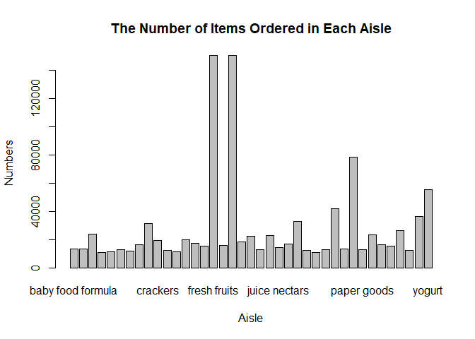
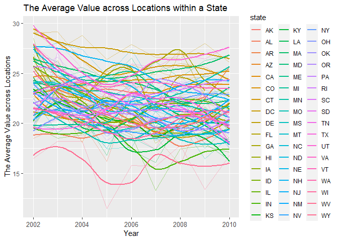
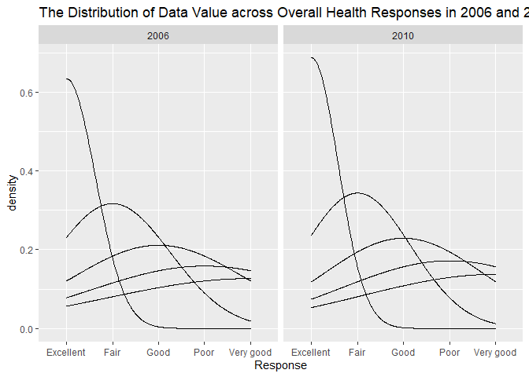
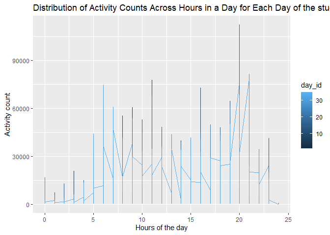

p8105\_hw23\_ms6358
================

## download the dataset

``` r
library(p8105.datasets)
library(tidyverse)
```

    ## -- Attaching packages --------------------------------------- tidyverse 1.3.1 --

    ## v ggplot2 3.3.5     v purrr   0.3.4
    ## v tibble  3.1.4     v dplyr   1.0.7
    ## v tidyr   1.1.3     v stringr 1.4.0
    ## v readr   2.0.1     v forcats 0.5.1

    ## -- Conflicts ------------------------------------------ tidyverse_conflicts() --
    ## x dplyr::filter() masks stats::filter()
    ## x dplyr::lag()    masks stats::lag()

``` r
library(readxl)
data("instacart")
data("brfss_smart2010")
```

## count the aisles and select the aisles that are the most items ordered from

``` r
instacart %>%
  count(aisle) 
```

    ## # A tibble: 134 x 2
    ##    aisle                      n
    ##    <chr>                  <int>
    ##  1 air fresheners candles  1067
    ##  2 asian foods             7007
    ##  3 baby accessories         306
    ##  4 baby bath body care      328
    ##  5 baby food formula      13198
    ##  6 bakery desserts         1501
    ##  7 baking ingredients     13088
    ##  8 baking supplies decor   1094
    ##  9 beauty                   287
    ## 10 beers coolers           1839
    ## # ... with 124 more rows

``` r
instacart %>%
  group_by(aisle) %>%
  summarize(n_obs = n()) %>% ## n_obs stands for the numbers of aisle
  arrange(desc(n_obs)) 
```

    ## # A tibble: 134 x 2
    ##    aisle                          n_obs
    ##    <chr>                          <int>
    ##  1 fresh vegetables              150609
    ##  2 fresh fruits                  150473
    ##  3 packaged vegetables fruits     78493
    ##  4 yogurt                         55240
    ##  5 packaged cheese                41699
    ##  6 water seltzer sparkling water  36617
    ##  7 milk                           32644
    ##  8 chips pretzels                 31269
    ##  9 soy lactosefree                26240
    ## 10 bread                          23635
    ## # ... with 124 more rows

There are 134 aisle, the aisle the most items ordered from are ‘fresh
vegetables’.

## Make a plot that shows the number of items ordered in each aisle

``` r
sum_product =
  instacart %>%
  group_by(aisle) %>%
  count(product_name, name = "product_count") 

sum_aisle = 
  aggregate(sum_product$product_count, by=list(aisle=sum_product$aisle), sum) %>% 
  rename(total_items = x) %>%
  filter(total_items > 10000) 
  
  names_aisles = c(pull(sum_aisle, aisle))
  barplot(total_items~aisle, sum_aisle, width = 10, names.arg = names_aisles, xlab = "Aisle", ylab = "Numbers", main = "The Number of Items Ordered in Each Aisle")
```

<!-- -->
\#\# Make a table showing the three most popular items in each of the
aisles “baking ingredients”, “dog food care”, and “packaged vegetables
fruits”

``` r
instacart %>%
  filter(aisle %in% c("baking ingredients", "packaged vegetables fruits", "dog food care")) %>%
  group_by(aisle, product_name) %>%
  summarize(count = n())%>%
  slice_max(product_name, n = 3) %>%
  knitr::kable(digits = 1)
```

    ## `summarise()` has grouped output by 'aisle'. You can override using the `.groups` argument.

| aisle                      | product\_name                                    | count |
|:---------------------------|:-------------------------------------------------|------:|
| baking ingredients         | Zero Calorie Sweetener                           |    95 |
| baking ingredients         | Zero Calorie Free Sweetener                      |     4 |
| baking ingredients         | Zero Calorie Sweetener Packets 50 Count          |     4 |
| dog food care              | Zero Grain Turkey Dog Food                       |     1 |
| dog food care              | Z Filets Grilled Beef Dog Treats                 |     1 |
| dog food care              | With Chicken & Veal in Meaty Juices Wet Dog Food |     5 |
| packaged vegetables fruits | Zucchini Squash, Baby Courgette                  |     5 |
| packaged vegetables fruits | Zucchini Noodles                                 |   182 |
| packaged vegetables fruits | Yukon Gold Potato                                |    62 |

## Make a table showing the mean hour of the day at which Pink Lady Apples and Coffee Ice Cream are ordered on each day of the week

``` r
sum_order_hour=
  instacart %>%
  filter (product_name %in% c("Pink Lady Apples", "Coffee Ice Cream")) %>%
  select(order_hour_of_day, order_dow) %>%
  group_by(order_dow) 

mean_hour = 
  aggregate(sum_order_hour$order_hour_of_day, by=list(order_dow=sum_order_hour$order_dow), mean) %>%
   rename(mean_hour_eachday = x) %>%
  pivot_wider(
    names_from = "order_dow",
    values_from = "mean_hour_eachday"
  ) %>%
  knitr::kable(digits = 2)
mean_hour
```

|    0 |     1 |     2 |     3 |     4 |     5 |     6 |
|-----:|------:|------:|------:|------:|------:|------:|
| 13.6 | 12.17 | 12.84 | 14.69 | 13.17 | 12.64 | 13.25 |

The structure of dataset is ‘r nrow(instacart)\` x 15 and has 1384617
obeservations. The key variables are order\_id, product\_id,
add\_to\_cart\_order, reordered, user\_id, eval\_set, order\_number,
order\_dow, order\_hour\_of\_day, days\_since\_prior\_order,
product\_name, aisle\_id, department\_id, aisle, department , for
example, the variable ’aisle’ is the specific passage from which
customers pick items they want, like buy item ‘cat food’ from the ailse
‘pet food’, buy different yogurt from the ailse ‘yogurt’.

Problem 2

\#\#do some data cleaning

``` r
brfss_df = 
  brfss_smart2010 %>%
  janitor::clean_names() %>%
  filter(topic == "Overall Health", response %in% c("Poor", "Fair", "Good", "Very good", "Excellent")) %>%
  separate(locationdesc, into = c("state", "location"), sep = ' - ') %>%
  select(-locationabbr)
```

    ## Warning in FUN(X[[i]], ...): strings not representable in native encoding will
    ## be translated to UTF-8

    ## Warning in FUN(X[[i]], ...): unable to translate '<U+00C4>' to native encoding

    ## Warning in FUN(X[[i]], ...): unable to translate '<U+00D6>' to native encoding

    ## Warning in FUN(X[[i]], ...): unable to translate '<U+00E4>' to native encoding

    ## Warning in FUN(X[[i]], ...): unable to translate '<U+00F6>' to native encoding

    ## Warning in FUN(X[[i]], ...): unable to translate '<U+00DF>' to native encoding

    ## Warning in FUN(X[[i]], ...): unable to translate '<U+00C6>' to native encoding

    ## Warning in FUN(X[[i]], ...): unable to translate '<U+00E6>' to native encoding

    ## Warning in FUN(X[[i]], ...): unable to translate '<U+00D8>' to native encoding

    ## Warning in FUN(X[[i]], ...): unable to translate '<U+00F8>' to native encoding

    ## Warning in FUN(X[[i]], ...): unable to translate '<U+00C5>' to native encoding

    ## Warning in FUN(X[[i]], ...): unable to translate '<U+00E5>' to native encoding

``` r
response = factor(brfss_df$response, levels("Poor, Fair, Good, Very good, Excellent") ,ordered = TRUE)
```

## Show states that were observed at 7 or more locations in 2002 and 2010

``` r
brfss_df %>%
  filter(year == "2002") %>%
  group_by(state) %>%
  distinct(location) %>%
  summarize(count = n()) %>%
  filter(count >= 7) %>%
  arrange(count) %>%
  knitr::kable(digits = 1)
```

| state | count |
|:------|------:|
| CT    |     7 |
| FL    |     7 |
| NC    |     7 |
| MA    |     8 |
| NJ    |     8 |
| PA    |    10 |

The result above showed that CT, FL, NC, MA, NJ, and PA were observed at
7 or more locations in 2002.

## The variable ‘count’ denotes the number of locations observed in each state

``` r
brfss_df %>%
  filter(year == "2010") %>%
  group_by(state) %>%
  distinct(location) %>%
  summarize(count = n()) %>%
  filter(count >= 7) %>%
  arrange(count) %>%
  knitr::kable(digits = 1)
```

| state | count |
|:------|------:|
| CO    |     7 |
| PA    |     7 |
| SC    |     7 |
| OH    |     8 |
| MA    |     9 |
| NY    |     9 |
| NE    |    10 |
| WA    |    10 |
| CA    |    12 |
| MD    |    12 |
| NC    |    12 |
| TX    |    16 |
| NJ    |    19 |
| FL    |    41 |

The result above showed that CO, PA, SC, OH, MA, NY, NE, WA, CA, MD, NC,
TX, NJ, and FL were observed at 7 or more locations in 2010.

\#\#Construct a dataset

``` r
brfss_excellect =
  brfss_df %>%
  filter(response == "Excellent") %>%
  group_by(state, year) %>%
  summarise(mean_data_value = mean(data_value)) 
```

    ## `summarise()` has grouped output by 'state'. You can override using the `.groups` argument.

``` r
brfss_excellect
```

    ## # A tibble: 443 x 3
    ## # Groups:   state [51]
    ##    state  year mean_data_value
    ##    <chr> <int>           <dbl>
    ##  1 AK     2002            27.9
    ##  2 AK     2003            24.8
    ##  3 AK     2004            23.0
    ##  4 AK     2005            23.8
    ##  5 AK     2007            23.5
    ##  6 AK     2008            20.6
    ##  7 AK     2009            23.2
    ##  8 AL     2002            18.5
    ##  9 AL     2003            19.5
    ## 10 AL     2004            20  
    ## # ... with 433 more rows

The chunck above constructs a dataset that is limited to Excellent
responses, and contains,year, state, and a variable that averages the
data\_value across locations within a state.

\#\#Make a plot showing a line for each state across years

``` r
brfss_excellect %>%
  ggplot(aes(x = year, y = mean_data_value, color = state)) + 
  geom_line(alpha = .4,aes(group = state)) +
  labs(x = "Year", y = " The Average Value across Locations", 
       title = "The Average Value across Locations within a State") + 
  geom_smooth(se = FALSE) +
  theme(axis.text.x = element_text(size = 10), legend.position = "right")
```

    ## `geom_smooth()` using method = 'loess' and formula 'y ~ x'

    ## Warning: Removed 4 rows containing non-finite values (stat_smooth).

    ## Warning: Removed 3 row(s) containing missing values (geom_path).

<!-- -->

The chunck above makes a plot showing a line for each state across
years.

\#\#Make a two-panel plot

``` r
brfss_df %>%
  filter(state == "NY", year %in% c("2006","2010")) %>%
  ggplot(aes(x = response, fill = data_value)) +
  geom_density(alpha = .4) + theme(legend.position = "none") + 
  labs(x = "Response", Y = "Data Value", title = "The Distribution of Data Value across Overall Health Responses in 2006 and 2010 in NY") +
  facet_grid(~year) +
  viridis::scale_fill_viridis(discrete = TRUE)
```

<!-- -->

The chunck above makes a two-panel plot showing, for the years 2006, and
2010, distribution of data\_value for responses (“Poor” to “Excellent”)
among locations in NY State.

Problem3

## Load, tidy, and otherwise wrangle the data

``` r
accelerometer_df = 
  read_csv("./data/accel_data.csv") %>%
  pivot_longer(
    activity.1:activity.1440,
     names_to = "activity_minute", 
    names_prefix = "activity.",
    values_to = "activity_count") %>%
  janitor::clean_names() %>%
  mutate(
     weekday_or_weekend = case_when(
        day %in% c("Monday","Tuesday", "Wednesday", "Thursday", "Friday") ~ "weekday",
      day %in% c("Saturday", "Sunday") ~ "weekend",
      TRUE      ~ ""
     ))
```

    ## Rows: 35 Columns: 1443

    ## -- Column specification --------------------------------------------------------
    ## Delimiter: ","
    ## chr    (1): day
    ## dbl (1442): week, day_id, activity.1, activity.2, activity.3, activity.4, ac...

    ## 
    ## i Use `spec()` to retrieve the full column specification for this data.
    ## i Specify the column types or set `show_col_types = FALSE` to quiet this message.

``` r
accelerometer_df           
```

    ## # A tibble: 50,400 x 6
    ##     week day_id day    activity_minute activity_count weekday_or_weekend
    ##    <dbl>  <dbl> <chr>  <chr>                    <dbl> <chr>             
    ##  1     1      1 Friday 1                         88.4 weekday           
    ##  2     1      1 Friday 2                         82.2 weekday           
    ##  3     1      1 Friday 3                         64.4 weekday           
    ##  4     1      1 Friday 4                         70.0 weekday           
    ##  5     1      1 Friday 5                         75.0 weekday           
    ##  6     1      1 Friday 6                         66.3 weekday           
    ##  7     1      1 Friday 7                         53.8 weekday           
    ##  8     1      1 Friday 8                         47.8 weekday           
    ##  9     1      1 Friday 9                         55.5 weekday           
    ## 10     1      1 Friday 10                        43.0 weekday           
    ## # ... with 50,390 more rows

The final dataset contains 50400 observations and 6 colums. The names of
varaibales are ‘r names(accelerometer\_df)’.

## create a table showing these totals

``` r
accelerometer_df %>%
  group_by(day_id) %>%
  summarise(
    total_count_day = sum(activity_count)
  ) %>%
  knitr::kable()
```

| day\_id | total\_count\_day |
|--------:|------------------:|
|       1 |         480542.62 |
|       2 |          78828.07 |
|       3 |         376254.00 |
|       4 |         631105.00 |
|       5 |         355923.64 |
|       6 |         307094.24 |
|       7 |         340115.01 |
|       8 |         568839.00 |
|       9 |         295431.00 |
|      10 |         607175.00 |
|      11 |         422018.00 |
|      12 |         474048.00 |
|      13 |         423245.00 |
|      14 |         440962.00 |
|      15 |         467420.00 |
|      16 |         685910.00 |
|      17 |         382928.00 |
|      18 |         467052.00 |
|      19 |         371230.00 |
|      20 |         381507.00 |
|      21 |         468869.00 |
|      22 |         154049.00 |
|      23 |         409450.00 |
|      24 |           1440.00 |
|      25 |         260617.00 |
|      26 |         340291.00 |
|      27 |         319568.00 |
|      28 |         434460.00 |
|      29 |         620860.00 |
|      30 |         389080.00 |
|      31 |           1440.00 |
|      32 |         138421.00 |
|      33 |         549658.00 |
|      34 |         367824.00 |
|      35 |         445366.00 |

The chunk above show total activity for each day. However, the trend is
not apparent.

## Make a single-panel plot that shows the 24-hour activity time courses for each day

``` r
accelerometer_df %>%
  mutate(
    hour = as.numeric(activity_minute)/60,
    hour = floor(hour)
  ) %>%
  group_by(day_id, hour) %>%
  summarise(
    total_count_hour = sum(activity_count)
  ) %>%
  ggplot(aes(x = hour, y = total_count_hour, color = day_id)) +
             geom_line() + 
      labs(
    title = "Distribution of Activity Counts Across Hours in a Day for Each Day of the study",
    x = "Hours of the day",
    y = "Activity count"
  )
```

    ## `summarise()` has grouped output by 'day_id'. You can override using the `.groups` argument.

<!-- -->

We can draw conclusion from the plot that the data is widely higher from
5 a.m to 10 p.m than the other time period which the individual might be
asleep. The data reaches the peak and around 8 p.m.
